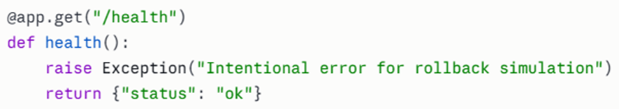
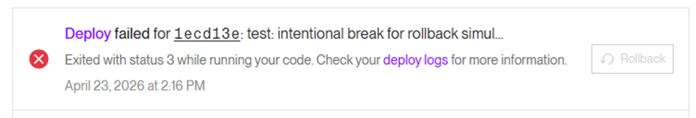
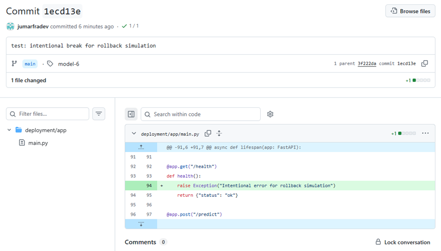
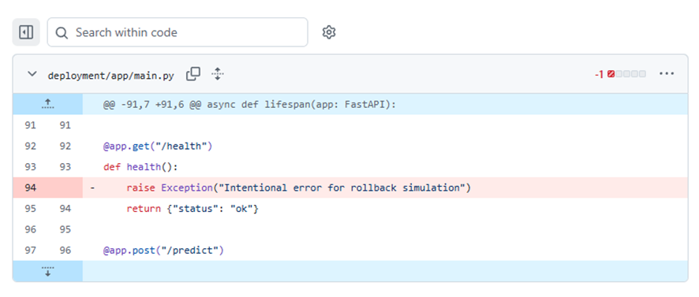
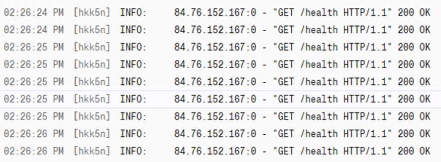
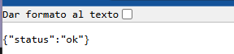

# pontia-modulo4-devops-entregable-grupo2
Trabajo del Grupo 2 - Módulo DevOps


Integrantes:

| Nombre Completo | Perfil de LinkedIn |
| :--- | :--- |
| Sergio Soriano San José | [LinkedIn](https://www.linkedin.com/in/sergio-soriano-san-jose/) |
| Raúl Sánchez Serrano | [LinkedIn](https://www.linkedin.com/in/raulsanchezserrano/) |
| Angel Pérez Izquierdo | [LinkedIn](https://www.linkedin.com/in/anpeiz/) |
| Juan Martínez Fraile | [LinkedIn](https://www.linkedin.com/in/juan-martinez-fraile/) |
| Manuel Yerbes García | [LinkedIn](https://www.linkedin.com/in/manuelyerbes/) |


## Infraestructura como Código (IaC) con Render Blueprints

En lugar de configurar el servicio manualmente desde la interfaz de Render, definimos toda la infraestructura en un archivo de código: `render.yaml`. Esto garantiza que la configuración sea reproducible, versionada y auditable.

Documentación oficial: https://render.com/docs/infrastructure-as-code

### Archivo render.yaml

```yaml
services:
  - type: web
    name: pontia-modulo4-devops-entregable-grupo2
    runtime: python
    region: frankfurt
    plan: free
    branch: main
    rootDir: deployment
    buildCommand: pip install -r requirements.txt
    startCommand: uvicorn app.main:app --host 0.0.0.0 --port $PORT
    envVars:
      - key: GITHUB_REPO
        value: SorianoTech/pontia-modulo4-devops-entregable-grupo2
      - key: PYTHON_VERSION
        value: "3.10"
```

### Explicación de cada campo

| Campo | Valor | Descripción |
|-------|-------|-------------|
| `type` | `web` | Tipo de servicio: Web Service (API HTTP) |
| `name` | `pontia-modulo4-devops-entregable-grupo2` | Nombre único del servicio en Render |
| `runtime` | `python` | Lenguaje de ejecución |
| `region` | `frankfurt` | Región del servidor (EU Central) |
| `plan` | `free` | Plan gratuito de Render |
| `branch` | `main` | Rama de GitHub que Render monitoriza |
| `rootDir` | `deployment` | Carpeta raíz donde está la app de la API |
| `buildCommand` | `pip install -r requirements.txt` | Comando que instala las dependencias |
| `startCommand` | `uvicorn app.main:app --host 0.0.0.0 --port $PORT` | Comando que arranca la API. `$PORT` es inyectado por Render |
| `GITHUB_REPO` | `SorianoTech/pontia-modulo4-devops-entregable-grupo2` | Variable de entorno para descargar artefactos de GitHub Releases |
| `PYTHON_VERSION` | `3.10` | Versión de Python utilizada |

### Pasos para vincular el Blueprint en Render

1. Subir el archivo `render.yaml` a la raíz del repositorio.
2. Ir a [dashboard.render.com](https://dashboard.render.com).
3. En el menú lateral, hacer click en **Blueprints**.
4. Click en **+ New Blueprint Instance**.
5. Seleccionar el repositorio del proyecto.
6. Render detecta automáticamente el archivo `render.yaml`.
7. Seleccionar **Associate existing services** si el servicio ya existe.
8. Escribir un nombre para el Blueprint.
9. Click en **Deploy Blueprint**.
10. Render aplica la configuración y despliega el servicio.

Una vez vinculado, cualquier cambio en `render.yaml` se sincroniza automáticamente con Render sin necesidad de tocar la interfaz web.

---

## Proceso de Rollback

El rollback permite revertir el servicio a una versión estable anterior si un despliegue falla o degrada el comportamiento.

### Simulación realizada

A continuación se documenta la simulación de rollback realizada sobre el repositorio.

#### Paso 1: Introducir un error intencionado

Se modificó el archivo `deployment/app/main.py` añadiendo un `raise Exception` en el endpoint `/health` para simular un fallo:



Se realizó commit y push a la rama `main`:

```bash
git add deployment/app/main.py
git commit -m "test: intentional break for rollback simulation"
git push origin main
```

#### Paso 2: Deploy fallido en Render

Al desplegar el cambio en Render, el servicio falló como se esperaba:



El commit en GitHub muestra la línea añadida que causó el fallo:



#### Paso 3: Ejecutar el rollback con git revert

Se ejecutó `git revert HEAD` para deshacer el cambio roto:

```bash
git revert HEAD --no-edit
git push origin main
```

El commit del revert elimina la línea del error:



#### Paso 4: Redesplegar y verificar

Se ejecutó un nuevo deploy en Render con el código corregido. Los logs confirman que el servicio volvió a responder correctamente con HTTP 200 OK:



Verificación del endpoint `/health` respondiendo correctamente tras el rollback:

<!-- TODO: Añadir captura cuando se reseteen los rate limits de GitHub y guardarla como rollback-06-health-ok-final.png -->


### Procedimiento general de Rollback

En caso de un despliegue fallido o degradación del servicio, seguir estos pasos:

1. **Detectar el problema:** verificar `/health` y `/predict`.
2. **Identificar el commit problemático:** `git log --oneline`.
3. **Revertir el cambio:** `git revert HEAD --no-edit` (o el hash del commit concreto).
4. **Push a main:** `git push origin main`.
5. **Redesplegar:** ejecutar el workflow Deploy manualmente o esperar al auto-deploy.
6. **Verificar la recuperación:** comprobar `/health` y `/predict`.