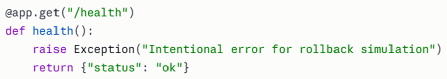
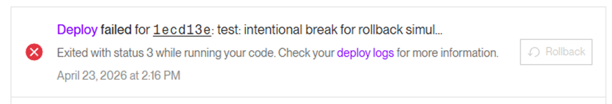
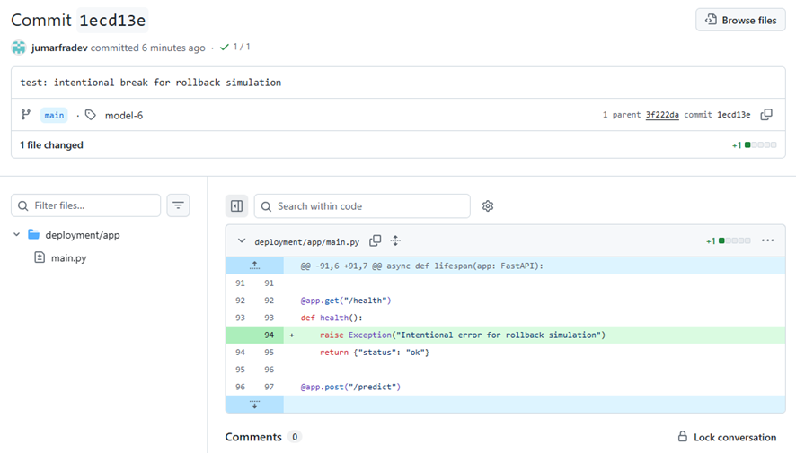
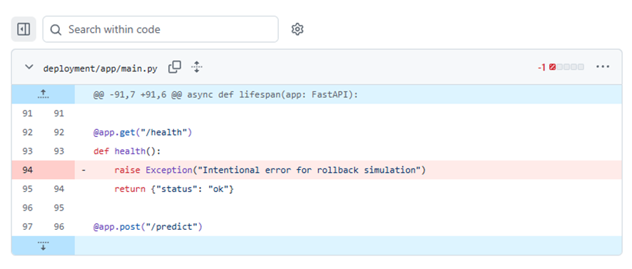
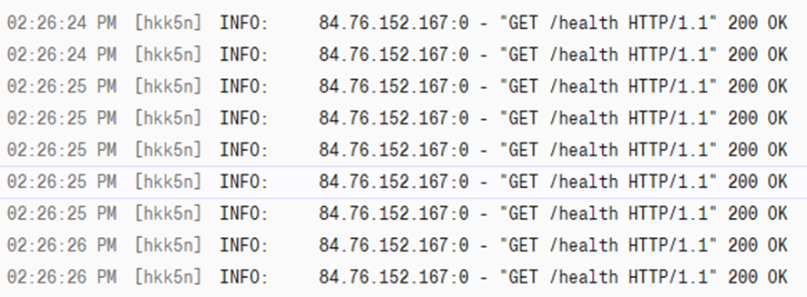
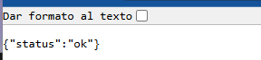

# Proyecto MLOps - Clasificacion de Ingresos (Adult Dataset)

Este repositorio implementa un flujo completo de MLOps para:

- entrenar un modelo de Machine Learning,
- validar el codigo con pruebas automatizadas,
- publicar artefactos versionados,
- y desplegar una API de inferencia.

El modelo entrenado es un `RandomForestClassifier` para predecir si una persona gana mas de 50K al anio, usando el dataset Adult Income de UCI.

## Integrantes del grupo

| Nombre Completo | Perfil de LinkedIn |
| :--- | :--- |
| Sergio Soriano San José | [LinkedIn](https://www.linkedin.com/in/sergio-soriano-san-jose/) |
| Raúl Sánchez Serrano | [LinkedIn](https://www.linkedin.com/in/raulsanchezserrano/) |
| Angel Pérez Izquierdo | [LinkedIn](https://www.linkedin.com/in/anpeiz/) |
| Juan Martínez Fraile | [LinkedIn](https://www.linkedin.com/in/juan-martinez-fraile/) |
| Manuel Yerbes García | [LinkedIn](https://www.linkedin.com/in/manuelyerbes/) |

## 1. Estructura de directorios

```text
.
|- .github/
|  \- workflows/
|     |- build.yml
|     |- deploy.yml
|     \- integration.yml
|- data/
|  \- raw/
|     \- .gitkeep
|- deployment/
|  |- requirements.txt
|  \- app/
|     |- __init__.py
|     \- main.py
|- model_tests/
|  |- __init__.py
|  \- test_model.py
|- models/
|- src/
|  |- __init__.py
|  |- data_loader.py
|  |- evaluate.py
|  |- main.py
|  \- model.py
|- unit_tests/
|  |- __init__.py
|  |- test_data_loader.py
|  |- test_evaluate.py
|  \- test_model.py
|- pytest.ini
|- README.md
\- requirements.txt
```

Resumen rapido:

- `src/`: pipeline de entrenamiento y evaluacion.
- `unit_tests/`: pruebas unitarias de funciones.
- `model_tests/`: pruebas sobre artefactos del modelo entrenado.
- `models/`: artefactos generados (`model.pkl`, `scaler.pkl`, `encoders.pkl`).
- `deployment/app/`: API FastAPI para servir predicciones.
- `.github/workflows/`: automatizacion CI/CD con GitHub Actions.

## 2. Explicacion del codigo

### 2.1 Entrenamiento y evaluacion

- `src/main.py`
  - Orquesta todo el pipeline:
  1. Carga datos desde `data/raw/adult.data` y `data/raw/adult.test`.
  2. Preprocesa (encoding + escalado).
  3. Entrena el modelo.
  4. Evalua metricas en test.
  5. Guarda artefactos en `models/`.
  - Ademas escribe logs en consola y en `training.log`.

- `src/data_loader.py`
  - Define columnas del dataset Adult.
  - `load_data(...)`:
    - lee train/test,
    - limpia valores faltantes,
    - normaliza la etiqueta de test (quita el punto final).
  - `preprocess_data(...)`:
    - codifica variables categoricas con `LabelEncoder`,
    - convierte el target `income` a binario (0/1),
    - aplica `StandardScaler`,
    - devuelve matrices listas para modelado y los objetos de preprocesado.

- `src/model.py`
  - `train_model(...)` crea y entrena un `RandomForestClassifier(random_state=42)`.

- `src/evaluate.py`
  - `evaluate(...)` calcula `accuracy` y `classification_report`.
  - Escribe resultados en logs.

### 2.2 Despliegue

- `deployment/app/main.py`
  - Levanta una API con FastAPI.
  - En el arranque (`lifespan`) descarga de la ultima GitHub Release:
    - `model.pkl`
    - `scaler.pkl`
    - `encoders.pkl`
  - Carga esos artefactos en memoria y expone endpoints:
    - `GET /health`: estado del servicio.
    - `POST /predict`: recibe un JSON con features y devuelve prediccion.
    - `GET /metrics`: contador simple de predicciones.

## 3. Workflows de GitHub Actions

El repositorio tiene tres workflows: `integration`, `build` y `deploy`.

## 3.1 Integracion (CI)

Disparadores:

- `pull_request` con destino a `main` bajo cualquiera de los siguientes estados:
  - `"opened"` (cuando se crea el pull request)
  - `"reopened"` (cuando se vuelve a abrir el pull request)
  - `"synchronize"` (cuando se sincroniza el pull request)
  - `"ready_for_review"` (cuando se indica que el pull request esta listo para revision)
- `workflow_dispatch` (disparo de ejecución manual)

Que hace:

1. Checkout del repositorio.
2. Configura Python 3.10.
3. Instala dependencias de `requirements.txt`.
4. Ejecuta pruebas unitarias en `unit_tests/` con cobertura (`pytest-cov`).
5. Guarda resultados (`test-results/results.log`, `test-results/results.xml`).
6. Comenta en la PR el resultado de tests + coverage.
7. Falla el job si las pruebas fallaron.

Carpetas/archivos que necesita:

- `unit_tests/`
- `src/`
- `requirements.txt`
- `pytest.ini`

## 3.2 Entrenamiento y publicacion de artefactos (CI)

Disparadores:

- `pull_request` con destino a `main` bajo cualquiera de los siguientes estados:
  - `"opened"` (cuando se crea el pull request)
  - `"reopened"` (cuando se vuelve a abrir el pull request)
  - `"synchronize"` (cuando se sincroniza el pull request)
  - `"ready_for_review"` (cuando se indica que el pull request esta listo para revision)
- `workflow_dispatch` (disparo de ejecución manual)

Que hace:

1. Checkout del repositorio.
2. Configura Python 3.10.
3. Instala dependencias de `requirements.txt`.
4. Descarga dataset Adult a `data/raw/`.
5. Ejecuta `python src/main.py` para entrenar.
6. Ejecuta pruebas de modelo en `model_tests/test_model.py`.
7. Publica artefactos (`models/model.pkl`, `models/scaler.pkl`, `models/encoders.pkl`) en una GitHub Release.

Carpetas/archivos que necesita:

- `src/`
- `model_tests/`
- `requirements.txt`
- `data/raw/` (la crea/usa durante el workflow)
- `models/` (se generan artefactos)

## 3.3 Despliegue (CD)

Disparador:

- `workflow_dispatch` (manual)

Que hace:

1. Checkout del repositorio.
2. Llama al `RENDER_DEPLOY_HOOK` para desplegar en Render.

Carpetas/archivos que necesita:

- Para ejecutar el workflow: no depende de carpetas especificas de codigo (solo del repositorio y del secreto `RENDER_DEPLOY_HOOK`).
- Para que la app desplegada funcione correctamente:
  - `deployment/app/`
  - `deployment/requirements.txt`
  - Artefactos publicados previamente por `build` en GitHub Releases.

## 3.4 Orden recomendado: integration, build y deploy

Si hablamos de flujo de calidad y entrega de extremo a extremo, el orden recomendado es:

1. **Integration (primero)**

- valida codigo y pruebas en cada PR antes de mergear.

1. **Build (segundo)**

- una vez en `main`, entrena, valida el modelo y publica artefactos versionados.

1. **Deploy (tercero)**

- despliega la aplicacion consumiendo la ultima release de artefactos.

Nota importante:

- En este repo `deploy` es manual, asi que debe ejecutarse despues de un `build` exitoso para asegurar que existan artefactos actualizados.

## 4. Como se realizan las pruebas

## 4.1 Pruebas unitarias

Objetivo:

- validar funciones del codigo fuente (`load_data`, `preprocess_data`, `train_model`, `evaluate`).

Ubicacion:

- `unit_tests/`

Comando recomendado:

```bash
PYTHONPATH=src pytest unit_tests/ --cov=model --cov=evaluate --cov=data_loader --cov-report=term --cov-report=html
```

En Windows PowerShell:

```powershell
$env:PYTHONPATH = "src"
pytest unit_tests/ --cov=model --cov=evaluate --cov=data_loader --cov-report=term --cov-report=html
```

Salida esperada:

- reporte de tests,
- porcentaje de cobertura,
- carpeta `htmlcov/` con reporte HTML.

## 4.2 Pruebas de modelo entrenado

Objetivo:

- validar que el artefacto del modelo existe, se puede cargar y predice correctamente.

Ubicacion:

- `model_tests/test_model.py`

Precondicion:

- haber entrenado antes (`python src/main.py`) para generar `models/model.pkl`.

Comando:

```bash
pytest model_tests/test_model.py
```

## 4.3 Flujo local sugerido

```bash
pip install -r requirements.txt
mkdir -p data/raw
# descargar adult.data y adult.test en data/raw
python src/main.py
PYTHONPATH=src pytest unit_tests/
python model_tests/test_model.py
```

## 5. Dependencias principales

Entrenamiento y pruebas (`requirements.txt`):

- scikit-learn
- pandas
- numpy
- joblib
- pytest
- pytest-cov

Serving (`deployment/requirements.txt`):

- fastapi
- uvicorn
- requests
- scikit-learn
- pandas
- numpy
- joblib

## Infraestructura como Código (IaC) con Render Blueprints

En lugar de configurar el servicio manualmente desde la interfaz de Render, definimos toda la infraestructura en un archivo de código: `render.yaml`. Esto garantiza que la configuración sea reproducible, versionada y auditable.

Documentación oficial: <https://render.com/docs/infrastructure-as-code>

### Archivo render.yaml

```yaml
services:
  - type: web
    name: pontia-modulo4-devops-entregable-grupo2
    runtime: python
    region: frankfurt
    plan: free
    branch: main
    rootDir: deployment
    buildCommand: pip install -r requirements.txt
    startCommand: uvicorn app.main:app --host 0.0.0.0 --port $PORT
    envVars:
      - key: GITHUB_REPO
        value: SorianoTech/pontia-modulo4-devops-entregable-grupo2
      - key: PYTHON_VERSION
        value: "3.10"
```

### Explicación de cada campo

| Campo | Valor | Descripción |
|-------|-------|-------------|
| `type` | `web` | Tipo de servicio: Web Service (API HTTP) |
| `name` | `pontia-modulo4-devops-entregable-grupo2` | Nombre único del servicio en Render |
| `runtime` | `python` | Lenguaje de ejecución |
| `region` | `frankfurt` | Región del servidor (EU Central) |
| `plan` | `free` | Plan gratuito de Render |
| `branch` | `main` | Rama de GitHub que Render monitoriza |
| `rootDir` | `deployment` | Carpeta raíz donde está la app de la API |
| `buildCommand` | `pip install -r requirements.txt` | Comando que instala las dependencias |
| `startCommand` | `uvicorn app.main:app --host 0.0.0.0 --port $PORT` | Comando que arranca la API. `$PORT` es inyectado por Render |
| `GITHUB_REPO` | `SorianoTech/pontia-modulo4-devops-entregable-grupo2` | Variable de entorno para descargar artefactos de GitHub Releases |
| `PYTHON_VERSION` | `3.10` | Versión de Python utilizada |

### Pasos para vincular el Blueprint en Render

1. Subir el archivo `render.yaml` a la raíz del repositorio.
2. Ir a [dashboard.render.com](https://dashboard.render.com).
3. En el menú lateral, hacer click en **Blueprints**.
4. Click en **+ New Blueprint Instance**.
5. Seleccionar el repositorio del proyecto.
6. Render detecta automáticamente el archivo `render.yaml`.
7. Seleccionar **Associate existing services** si el servicio ya existe.
8. Escribir un nombre para el Blueprint.
9. Click en **Deploy Blueprint**.
10. Render aplica la configuración y despliega el servicio.

Una vez vinculado, cualquier cambio en `render.yaml` se sincroniza automáticamente con Render sin necesidad de tocar la interfaz web.

---

## Proceso de Rollback

El rollback permite revertir el servicio a una versión estable anterior si un despliegue falla o degrada el comportamiento.

### Simulación realizada

A continuación se documenta la simulación de rollback realizada sobre el repositorio.

#### Paso 1: Introducir un error intencionado

Se modificó el archivo `deployment/app/main.py` añadiendo un `raise Exception` en el endpoint `/health` para simular un fallo:



Se realizó commit y push a la rama `main`:

```bash
git add deployment/app/main.py
git commit -m "test: intentional break for rollback simulation"
git push origin main
```

#### Paso 2: Deploy fallido en Render

Al desplegar el cambio en Render, el servicio falló como se esperaba:



El commit en GitHub muestra la línea añadida que causó el fallo:



#### Paso 3: Ejecutar el rollback con git revert

Se ejecutó `git revert HEAD` para deshacer el cambio roto:

```bash
git revert HEAD --no-edit
git push origin main
```

El commit del revert elimina la línea del error:



#### Paso 4: Redesplegar y verificar

Se ejecutó un nuevo deploy en Render con el código corregido. Los logs confirman que el servicio volvió a responder correctamente con HTTP 200 OK:



Verificación del endpoint `/health` respondiendo correctamente tras el rollback:

<!-- TODO: Añadir captura cuando se reseteen los rate limits de GitHub y guardarla como rollback-06-health-ok-final.png -->


### Procedimiento general de Rollback

En caso de un despliegue fallido o degradación del servicio, seguir estos pasos:

1. **Detectar el problema:** verificar `/health` y `/predict`.
2. **Identificar el commit problemático:** `git log --oneline`.
3. **Revertir el cambio:** `git revert HEAD --no-edit` (o el hash del commit concreto).
4. **Push a main:** `git push origin main`.
5. **Redesplegar:** ejecutar el workflow Deploy manualmente o esperar al auto-deploy.
6. **Verificar la recuperación:** comprobar `/health` y `/predict`.
